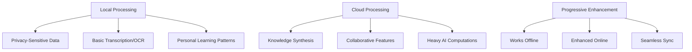

# Synapse AI Note-Taking App: Comprehensive Improvement Recommendations

## Executive Summary

### Key Findings
The original Synapse proposal has a solid foundation but needs significant refinement to compete in the crowded note-taking market. The core concept of multimodal, AI-enhanced note-taking is valuable, but the execution strategy requires focus and differentiation.

### Revised Value Proposition
**Original**: "AI-enhanced note taking app"  
**Recommended**: "Synapse learns how you learn. The first note-taking app that adapts to your learning patterns, identifies knowledge gaps, and actively helps you understand complex topics better."

### Critical Recommendations
1. **Pivot from generic AI to Learning Intelligence**
2. **Narrow MVP scope to voice-to-structured-notes**
3. **Target specific academic niches initially**
4. **Implement hybrid cloud-local architecture**
5. **Focus on true multimodal synthesis, not just capture**

---

## Competitive Analysis Updates

### Missing Competitors (2024)

| Competitor | Key Features | Market Position | Threat Level |
|------------|--------------|-----------------|--------------|
| **Reflect** | AI-powered networked thought, real-time suggestions | Growing AI-native player | High |
| **Mem.ai** | AI-first knowledge management, automatic organization | Well-funded, enterprise focus | Medium |
| **NotebookLM** | Source-grounded AI, document analysis | Google-backed, closest conceptual competitor | Very High |
| **LogSeq** | Open-source, block-based, growing rapidly | Free alternative to Roam | Medium |

### Updated Market Reality

#### Notion's Evolution
- **2024 Capabilities**: Advanced AI features, custom GPTs, multimodal support
- **Threat**: No longer just a database tool - now a comprehensive AI workspace
- **Implication**: Higher bar for AI features, need stronger differentiation

#### Obsidian's Ecosystem
- **Plugin Ecosystem**: 1000+ community plugins including AI integrations
- **Canvas Feature**: Visual knowledge mapping
- **Implication**: Free alternative with extensible AI capabilities

#### Roam Research Decline
- **Status**: Losing users to LogSeq, Obsidian, and Notion
- **Opportunity**: Capture users seeking better networked thought tools

---

## Unique Differentiation Strategies

### 1. Learning Intelligence (Core Differentiator)

#### Adaptive Learning Features
- **Personal Forgetting Curve Analysis**: Track what you forget and when
- **Concept Gap Detection**: AI identifies missing connections in your knowledge
- **Learning Style Adaptation**: Interface and suggestions adapt to visual/auditory/kinesthetic preferences
- **Performance-Based Scheduling**: Optimal review timing based on your actual performance

#### Subject-Aware AI
```
Medical Students: Recognizes anatomy terms, suggests related concepts
Law Students: Identifies case relationships, argument structures
STEM Students: Connects formulas, derives relationships
```

### 2. True Multimodal Synthesis

#### Beyond Capture - Active Synthesis
- **Cross-Modal Search**: "Find my handwritten notes about photosynthesis" (voice query)
- **Format Intelligence**: Voice → concept maps, sketches → structured text
- **Contextual Mode Switching**: Lecture mode vs. study mode vs. review mode
- **Semantic Bridging**: Connect ideas across different input modalities

### 3. Collaborative Learning Intelligence

#### Anonymous Knowledge Sharing
- **Concept Pools**: Contribute explanations without revealing identity
- **Peer Validation**: Community-verified study materials
- **Learning Cohorts**: AI-matched study groups based on learning patterns

---

## Technical Feasibility Recommendations

### Hybrid Architecture Strategy



### Realistic AI Implementation Timeline

| Phase | Duration | Capabilities | Technical Approach |
|-------|----------|--------------|-------------------|
| **Phase 1** | 3-4 months | Voice-to-text with basic AI enhancement | Cloud-based Whisper + GPT-4 |
| **Phase 2** | 4-6 months | Subject-aware processing, basic handwriting | Add domain-specific models |
| **Phase 3** | 6-8 months | Cross-modal synthesis, offline basics | Hybrid architecture, local models |
| **Phase 4** | 8-12 months | Full multimodal, advanced learning analytics | Custom learning intelligence models |

### Technology Stack Recommendations

#### Core Technologies
- **Frontend**: React Native (cross-platform) or Flutter
- **Backend**: Node.js/Python hybrid (Node for real-time, Python for AI)
- **AI/ML**: OpenAI APIs → Custom models → Local inference
- **Database**: PostgreSQL + Vector DB (Pinecone/Weaviate)
- **Real-time**: WebRTC for collaboration, WebSockets for sync

---

## Refined MVP Strategy: Quality-First Approach

### Core Philosophy
**"Perfect one thing rather than building many mediocre features"**

Focus exclusively on delivering the highest quality voice-to-intelligent-notes experience for medical students, with AI that truly understands academic content and generates study-ready materials.

### MVP Scope: Context-Aware Voice Notes for Medical Students

#### Single Core Feature: Intelligent Medical Note Generation
**What it does**: Transforms rambling voice recordings into structured, study-ready medical notes with context-aware AI processing.

**Key Capabilities**:
1. **Medical-Aware Transcription**
   - 95%+ accuracy for medical terminology (anatomy, pharmacology, pathology)
   - Automatic spelling correction for complex medical terms
   - Context-aware punctuation and formatting

2. **Intelligent Content Structuring**
   - Converts voice input into organized study formats (case studies, symptom lists, treatment protocols)
   - Identifies and highlights key medical concepts, relationships, and mechanisms
   - Generates automatic summaries with clinical relevance

3. **Subject-Specific Intelligence**
   - Recognizes medical contexts (lectures, case discussions, study sessions)
   - Suggests related medical concepts and cross-references
   - Formats content according to medical education standards

#### Deliberately Excluded Features
- ❌ Handwriting input (focus on voice perfection first)
- ❌ Multiple subject areas (medical-only for MVP)
- ❌ Collaboration features
- ❌ Advanced visual elements
- ❌ Offline processing (cloud-first for quality)
- ❌ Generic note-taking features

### Success Criteria: Quality Over Quantity

#### Primary Success Metrics (Quality-Focused)
- **Note Quality Score**: 4.5/5 average user rating for generated note usefulness
- **Medical Accuracy**: 95%+ accuracy for medical term recognition and context
- **Study Effectiveness**: 80% of users report improved study outcomes using generated notes
- **Time Savings**: 60% reduction in note organization time vs. manual methods

#### Secondary Success Metrics (Engagement)
- **Weekly Active Usage**: 70% of users create notes weekly
- **Session Quality**: Average 15+ minutes per note creation session
- **Retention**: 40% monthly active users after 3 months (higher bar due to focused value)
- **Net Promoter Score**: 50+ among medical student users

#### Technical Quality Benchmarks
- **Transcription Accuracy**: 95% for medical terminology, 98% for general speech
- **Processing Speed**: <30 seconds for 10-minute voice note structuring
- **System Reliability**: 99.5% uptime during peak study periods
- **Content Relevance**: 90% of suggested concepts rated as helpful by users

---

## Go-to-Market Strategy

### Target Market Segmentation

#### Primary Target: Medical Students
- **Pain Point**: Complex terminology, need for precise note-taking
- **Value Prop**: AI that understands medical terms, creates study guides
- **Acquisition**: Partner with medical schools, target MCAT prep communities

#### Secondary Target: Law Students
- **Pain Point**: Case analysis, argument mapping, dense reading
- **Value Prop**: Structure case briefs, identify legal relationships
- **Acquisition**: Law school partnerships, bar exam prep integration

#### Tertiary Target: STEM Graduate Students
- **Pain Point**: Complex concepts, research note organization
- **Value Prop**: Formula recognition, concept relationship mapping
- **Acquisition**: Research lab partnerships, academic conferences

### Pricing Strategy

| Tier | Price | Features | Target |
|------|-------|----------|---------|
| **Free** | $0 | Basic voice-to-text, 100 notes/month | Trial users, basic needs |
| **Student** | $9/month | Learning intelligence, unlimited notes, export | Primary target market |
| **Pro** | $19/month | Collaboration, advanced AI, integrations | Power users, professionals |
| **Institution** | $12/user/month | Admin controls, analytics, bulk management | Universities, organizations |

### User Acquisition Strategy

#### Phase 1: Validation (Months 1-3)
- **Beta Program**: 100 medical students at 2-3 universities
- **Feedback Loop**: Weekly interviews, usage analytics
- **Iteration**: Rapid feature refinement based on feedback

#### Phase 2: Early Adoption (Months 4-9)
- **University Partnerships**: Pilot programs at 10 institutions
- **Content Marketing**: Study technique blogs, academic productivity content
- **Referral Program**: Free months for successful referrals

#### Phase 3: Scale (Months 10-18)
- **Viral Features**: Shareable study guides, collaborative problem-solving
- **Integration Strategy**: LMS integrations, academic tool partnerships
- **Paid Acquisition**: Targeted ads on academic platforms

---

## 6-Month MVP Implementation Plan

### Development Philosophy
**"Ship fast, iterate faster, but never compromise on core quality"**

Focus on rapid development cycles with continuous user feedback integration, while maintaining uncompromising standards for medical note quality and AI accuracy.

### Month 1: Foundation & Medical AI Core
**Goal**: Establish medical-aware transcription and basic structuring

#### Week 1-2: Technical Foundation
- [ ] Set up cloud infrastructure (AWS/GCP with GPU instances)
- [ ] Integrate Whisper API with medical terminology fine-tuning
- [ ] Build basic voice recording interface (web-based for rapid iteration)
- [ ] Establish medical terminology database (10,000+ terms)

#### Week 3-4: Medical Intelligence Layer
- [ ] Implement medical context recognition (anatomy, pharmacology, pathology)
- [ ] Build basic content structuring algorithms
- [ ] Create medical note templates (case studies, lecture notes, study guides)
- [ ] Develop quality scoring system for generated content
      

#### Success Metrics
- 90% transcription accuracy for medical terms
- Basic note structuring functional for 5 medical topics
- Processing time <60 seconds for 10-minute recordings

#### Risk Mitigation Checkpoint
- **Risk**: Medical terminology accuracy below 90%
- **Mitigation**: Expand medical training data, implement user correction feedback loop

---

### Month 2: Quality Enhancement & User Testing
**Goal**: Achieve medical-grade accuracy and begin user validation

#### Week 1-2: AI Quality Improvement
- [ ] Implement medical concept relationship mapping
- [ ] Add clinical context awareness (symptoms → diagnosis → treatment)
- [ ] Build automatic medical abbreviation expansion
- [ ] Create quality assurance pipeline with medical validation

#### Week 3-4: Alpha Testing Program
- [ ] Recruit 10 medical students from target university
- [ ] Implement user feedback collection system
- [ ] Build note quality rating interface
- [ ] Establish weekly feedback review process

#### Success Metrics
- 95% medical terminology accuracy
- 4.0/5 average note quality rating from alpha users
- 80% of alpha users complete weekly testing sessions

#### Risk Mitigation Checkpoint
- **Risk**: User feedback indicates poor note quality
- **Mitigation**: Implement rapid iteration cycle, daily feedback review

---

### Month 3: Advanced Medical Intelligence
**Goal**: Implement sophisticated medical reasoning and context awareness

#### Week 1-2: Clinical Reasoning Integration
- [ ] Build disease-symptom relationship mapping
- [ ] Implement treatment protocol recognition
- [ ] Add drug interaction and contraindication awareness
- [ ] Create medical case study auto-generation

#### Week 3-4: Study Format Optimization
- [ ] Develop multiple note formats (SOAP notes, differential diagnosis, study cards)
- [ ] Implement automatic medical concept highlighting
- [ ] Build cross-reference system for related medical topics
- [ ] Add medical exam question generation

#### Success Metrics
- Support for 15+ medical specialties
- 4.3/5 average note usefulness rating
- 70% of users report improved study efficiency

#### Risk Mitigation Checkpoint
- **Risk**: Feature complexity reduces core quality
- **Mitigation**: Maintain focus on core transcription quality, feature toggle system

---

### Month 4: Beta Launch Preparation
**Goal**: Prepare for broader beta launch with refined product

#### Week 1-2: Product Polish & Optimization
- [ ] Implement user onboarding flow
- [ ] Build comprehensive error handling and recovery
- [ ] Optimize processing speed (<30 seconds for 10-minute notes)
- [ ] Create user analytics and usage tracking

#### Week 3-4: Beta Launch Infrastructure
- [ ] Scale infrastructure for 100 concurrent users
- [ ] Implement user authentication and data security
- [ ] Build customer support system
- [ ] Create beta user recruitment materials

#### Success Metrics
- System supports 100 concurrent users without degradation
- <5 second app load time
- Customer support response time <4 hours

#### Risk Mitigation Checkpoint
- **Risk**: Infrastructure cannot handle user load
- **Mitigation**: Load testing, auto-scaling implementation, fallback systems

---

### Month 5: Beta Launch & User Acquisition
**Goal**: Launch beta with 50 medical students and gather comprehensive feedback

#### Week 1-2: Beta Launch Execution
- [ ] Launch beta program at 2 medical schools
- [ ] Implement comprehensive user onboarding
- [ ] Begin daily usage analytics monitoring
- [ ] Start weekly user feedback sessions

#### Week 3-4: Rapid Iteration Based on Feedback
- [ ] Implement top 3 user-requested improvements
- [ ] Optimize AI models based on real usage patterns
- [ ] Expand medical terminology coverage based on user content
- [ ] Build user success stories and case studies


#### Success Metrics
- 50 active beta users
- 4.5/5 average note quality rating
- 60% weekly active usage rate
- 80% user retention after 4 weeks

#### Risk Mitigation Checkpoint
- **Risk**: Low user adoption or engagement
- **Mitigation**: Enhanced onboarding, personal user success calls, feature pivots

---

### Month 6: MVP Refinement & Launch Preparation
**Goal**: Achieve MVP success criteria and prepare for public launch

#### Week 1-2: Product Optimization
- [ ] Implement advanced medical reasoning features
- [ ] Optimize user interface based on usage patterns
- [ ] Build comprehensive help documentation
- [ ] Implement advanced analytics and user insights

#### Week 3-4: Launch Readiness
- [ ] Finalize pricing strategy and payment integration
- [ ] Prepare marketing materials and launch campaign
- [ ] Build scalable customer onboarding process
- [ ] Establish metrics dashboard for post-launch monitoring

#### Success Metrics
- 95% medical terminology accuracy achieved
- 4.5/5 average note quality rating maintained
- 70% of beta users willing to pay for the service
- Technical infrastructure ready for 500+ users

#### Risk Mitigation Checkpoint
- **Risk**: Product not ready for public launch
- **Mitigation**: Extended beta period, feature freeze, focus on stability

---

### Technical Architecture for Quality-First MVP

#### Core Technology Stack
```
Frontend: React Web App (mobile-responsive)
├── Voice Recording: WebRTC + MediaRecorder API
├── Real-time Feedback: WebSocket connections
└── Offline Capability: Service Workers + IndexedDB

Backend: Python FastAPI + Node.js
├── AI Processing: OpenAI Whisper + GPT-4 + Custom Medical Models
├── Medical Database: PostgreSQL + Vector DB (Pinecone)
├── Real-time Processing: Redis + Celery
└── File Storage: AWS S3 + CloudFront CDN

Infrastructure: AWS Cloud
├── Compute: ECS Fargate + Lambda functions
├── AI Processing: GPU instances (p3.2xlarge)
├── Database: RDS PostgreSQL + ElastiCache
└── Monitoring: CloudWatch + DataDog
```

#### Quality Assurance Pipeline
1. **Medical Accuracy Validation**: Automated testing against medical terminology databases
2. **Content Quality Scoring**: ML model trained on medical educator feedback
3. **User Experience Monitoring**: Real-time analytics on note creation success rates
4. **Performance Benchmarking**: Continuous monitoring of processing speed and accuracy

#### Scalability Considerations
- **Auto-scaling**: Automatic resource scaling based on user demand
- **Load Balancing**: Distributed processing for voice transcription and AI analysis
- **Caching Strategy**: Intelligent caching of medical concepts and user patterns
- **Backup Systems**: Redundant processing pipelines for high availability

### Post-MVP Success Indicators
- **Product-Market Fit**: 40% monthly user retention, 4.5+ note quality rating
- **Revenue Validation**: 30% conversion rate from free to paid users
- **Market Expansion**: Ready to expand to 5+ medical schools
- **Technical Scalability**: Infrastructure supports 1000+ concurrent users

---

## Risk Mitigation

### Technical Risks

#### Risk: Offline AI Performance
- **Mitigation**: Hybrid approach with graceful degradation
- **Fallback**: Cloud processing with local caching
- **Timeline**: Delay offline features if necessary

#### Risk: Transcription Accuracy
- **Mitigation**: Multiple AI models, user correction feedback
- **Fallback**: Manual editing tools, export options
- **Monitoring**: Real-time accuracy metrics

### Market Risks

#### Risk: Established Competitor Response
- **Mitigation**: Focus on learning intelligence differentiation
- **Strategy**: Build switching costs through personalized AI
- **Monitoring**: Competitive feature tracking

#### Risk: User Acquisition Costs
- **Mitigation**: University partnership strategy
- **Fallback**: Organic growth through viral features
- **Metrics**: CAC:LTV ratio monitoring

### Business Risks

#### Risk: Funding Requirements
- **Mitigation**: Lean MVP approach, early revenue generation
- **Strategy**: Bootstrap to product-market fit
- **Timeline**: Seek funding only after proven traction

---

## Next Steps

### Immediate Actions (Next 30 Days)

1. **[ ] Conduct User Research**
   - Interview 20 medical students about current note-taking pain points
   - Validate voice-to-structured-notes concept
   - Identify specific terminology and formatting needs

2. **[ ] Technical Feasibility Study**
   - Prototype voice transcription with medical term recognition
   - Test AI structure generation with sample content
   - Evaluate cloud vs. local processing trade-offs

3. **[ ] Competitive Deep Dive**
   - Trial NotebookLM, Reflect, and Mem.ai for 2 weeks each
   - Document specific feature gaps and opportunities
   - Analyze pricing and positioning strategies

4. **[ ] Refine Value Proposition**
   - A/B test messaging with target users
   - Create clear differentiation from existing tools
   - Develop compelling demo scenarios

### Short-term Goals (Next 90 Days)

1. **[ ] Build MVP Prototype**
   - Core voice recording and transcription
   - Basic AI structure generation
   - Simple note organization

2. **[ ] Establish University Partnerships**
   - Identify 3 target medical schools
   - Develop partnership proposals
   - Secure beta testing agreements

3. **[ ] Develop Go-to-Market Materials**
   - Create demo videos and case studies
   - Build landing page with email capture
   - Develop content marketing strategy

### Long-term Objectives (Next 12 Months)

1. **[ ] Achieve Product-Market Fit**
   - 1,000+ active users with strong engagement
   - Clear evidence of value creation
   - Sustainable unit economics

2. **[ ] Expand Market Reach**
   - Multiple academic disciplines
   - International university partnerships
   - Professional market exploration

3. **[ ] Prepare for Scale**
   - Series A funding preparation
   - Team expansion planning
   - Technology infrastructure scaling

---

*This document should be reviewed and updated monthly as the product evolves and market conditions change.*
