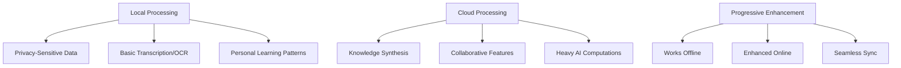

# Synapse AI Note-Taking App: Comprehensive Improvement Recommendations

## Executive Summary

### Key Findings
The original Synapse proposal has a solid foundation but needs significant refinement to compete in the crowded note-taking market. The core concept of multimodal, AI-enhanced note-taking is valuable, but the execution strategy requires focus and differentiation.

### Revised Value Proposition
**Original**: "AI-enhanced note taking app"  
**Recommended**: "Synapse learns how you learn. The first note-taking app that adapts to your learning patterns, identifies knowledge gaps, and actively helps you understand complex topics better."

### Critical Recommendations
1. **Pivot from generic AI to Learning Intelligence**
2. **Narrow MVP scope to voice-to-structured-notes**
3. **Target specific academic niches initially**
4. **Implement hybrid cloud-local architecture**
5. **Focus on true multimodal synthesis, not just capture**

---

## Competitive Analysis Updates

### Missing Competitors (2024)

| Competitor | Key Features | Market Position | Threat Level |
|------------|--------------|-----------------|--------------|
| **Reflect** | AI-powered networked thought, real-time suggestions | Growing AI-native player | High |
| **Mem.ai** | AI-first knowledge management, automatic organization | Well-funded, enterprise focus | Medium |
| **NotebookLM** | Source-grounded AI, document analysis | Google-backed, closest conceptual competitor | Very High |
| **LogSeq** | Open-source, block-based, growing rapidly | Free alternative to Roam | Medium |

### Updated Market Reality

#### Notion's Evolution
- **2024 Capabilities**: Advanced AI features, custom GPTs, multimodal support
- **Threat**: No longer just a database tool - now a comprehensive AI workspace
- **Implication**: Higher bar for AI features, need stronger differentiation

#### Obsidian's Ecosystem
- **Plugin Ecosystem**: 1000+ community plugins including AI integrations
- **Canvas Feature**: Visual knowledge mapping
- **Implication**: Free alternative with extensible AI capabilities

#### Roam Research Decline
- **Status**: Losing users to LogSeq, Obsidian, and Notion
- **Opportunity**: Capture users seeking better networked thought tools

---

## Unique Differentiation Strategies

### 1. Learning Intelligence (Core Differentiator)

#### Adaptive Learning Features
- **Personal Forgetting Curve Analysis**: Track what you forget and when
- **Concept Gap Detection**: AI identifies missing connections in your knowledge
- **Learning Style Adaptation**: Interface and suggestions adapt to visual/auditory/kinesthetic preferences
- **Performance-Based Scheduling**: Optimal review timing based on your actual performance

#### Subject-Aware AI
```
Medical Students: Recognizes anatomy terms, suggests related concepts
Law Students: Identifies case relationships, argument structures
STEM Students: Connects formulas, derives relationships
```

### 2. True Multimodal Synthesis

#### Beyond Capture - Active Synthesis
- **Cross-Modal Search**: "Find my handwritten notes about photosynthesis" (voice query)
- **Format Intelligence**: Voice → concept maps, sketches → structured text
- **Contextual Mode Switching**: Lecture mode vs. study mode vs. review mode
- **Semantic Bridging**: Connect ideas across different input modalities

### 3. Collaborative Learning Intelligence

#### Anonymous Knowledge Sharing
- **Concept Pools**: Contribute explanations without revealing identity
- **Peer Validation**: Community-verified study materials
- **Learning Cohorts**: AI-matched study groups based on learning patterns

---

## Technical Feasibility Recommendations

### Hybrid Architecture Strategy



### Realistic AI Implementation Timeline

| Phase | Duration | Capabilities | Technical Approach |
|-------|----------|--------------|-------------------|
| **Phase 1** | 3-4 months | Voice-to-text with basic AI enhancement | Cloud-based Whisper + GPT-4 |
| **Phase 2** | 4-6 months | Subject-aware processing, basic handwriting | Add domain-specific models |
| **Phase 3** | 6-8 months | Cross-modal synthesis, offline basics | Hybrid architecture, local models |
| **Phase 4** | 8-12 months | Full multimodal, advanced learning analytics | Custom learning intelligence models |

### Technology Stack Recommendations

#### Core Technologies
- **Frontend**: React Native (cross-platform) or Flutter
- **Backend**: Node.js/Python hybrid (Node for real-time, Python for AI)
- **AI/ML**: OpenAI APIs → Custom models → Local inference
- **Database**: PostgreSQL + Vector DB (Pinecone/Weaviate)
- **Real-time**: WebRTC for collaboration, WebSockets for sync

---

## Revised MVP Strategy

### MVP Scope: Voice-to-Structured-Notes

#### Core Features (Must Have)
1. **Voice Recording & Transcription**
   - Real-time transcription with speaker identification
   - Automatic punctuation and formatting
   - Offline capability for basic recording

2. **AI-Enhanced Structure Generation**
   - Convert rambling voice notes into structured outlines
   - Identify key concepts and relationships
   - Generate automatic summaries and action items

3. **Subject-Aware Processing**
   - Recognize academic terminology (medical, legal, STEM)
   - Suggest related concepts and connections
   - Format according to subject conventions

#### Secondary Features (Should Have)
- Basic handwriting input (text only, no drawings)
- Simple linking between notes
- Export to common formats (Markdown, PDF)

#### Excluded from MVP
- ❌ Full multimodal canvas
- ❌ Collaborative features
- ❌ Advanced knowledge graphs
- ❌ Offline AI processing
- ❌ Complex visual elements

### Success Metrics for MVP
- **User Engagement**: 70% of users record voice notes within first week
- **Value Demonstration**: 50% of users report structured output saves time
- **Retention**: 30% monthly active users after 3 months
- **Quality**: 90% transcription accuracy for clear speech

---

## Go-to-Market Strategy

### Target Market Segmentation

#### Primary Target: Medical Students
- **Pain Point**: Complex terminology, need for precise note-taking
- **Value Prop**: AI that understands medical terms, creates study guides
- **Acquisition**: Partner with medical schools, target MCAT prep communities

#### Secondary Target: Law Students
- **Pain Point**: Case analysis, argument mapping, dense reading
- **Value Prop**: Structure case briefs, identify legal relationships
- **Acquisition**: Law school partnerships, bar exam prep integration

#### Tertiary Target: STEM Graduate Students
- **Pain Point**: Complex concepts, research note organization
- **Value Prop**: Formula recognition, concept relationship mapping
- **Acquisition**: Research lab partnerships, academic conferences

### Pricing Strategy

| Tier | Price | Features | Target |
|------|-------|----------|---------|
| **Free** | $0 | Basic voice-to-text, 100 notes/month | Trial users, basic needs |
| **Student** | $9/month | Learning intelligence, unlimited notes, export | Primary target market |
| **Pro** | $19/month | Collaboration, advanced AI, integrations | Power users, professionals |
| **Institution** | $12/user/month | Admin controls, analytics, bulk management | Universities, organizations |

### User Acquisition Strategy

#### Phase 1: Validation (Months 1-3)
- **Beta Program**: 100 medical students at 2-3 universities
- **Feedback Loop**: Weekly interviews, usage analytics
- **Iteration**: Rapid feature refinement based on feedback

#### Phase 2: Early Adoption (Months 4-9)
- **University Partnerships**: Pilot programs at 10 institutions
- **Content Marketing**: Study technique blogs, academic productivity content
- **Referral Program**: Free months for successful referrals

#### Phase 3: Scale (Months 10-18)
- **Viral Features**: Shareable study guides, collaborative problem-solving
- **Integration Strategy**: LMS integrations, academic tool partnerships
- **Paid Acquisition**: Targeted ads on academic platforms

---

## Implementation Roadmap

### Phase 1: Foundation (Months 1-4)
**Goal**: Prove voice-to-structured-notes concept

#### Milestones
- [ ] **Month 1**: Core voice recording and transcription
- [ ] **Month 2**: Basic AI structure generation
- [ ] **Month 3**: Subject-aware processing for medical terms
- [ ] **Month 4**: Beta launch with 50 medical students

#### Success Criteria
- 90% transcription accuracy
- 70% user satisfaction with structured output
- 50% weekly active usage among beta users

### Phase 2: Enhancement (Months 5-8)
**Goal**: Add handwriting and improve AI capabilities

#### Milestones
- [ ] **Month 5**: Handwriting input integration
- [ ] **Month 6**: Cross-modal search capabilities
- [ ] **Month 7**: Learning pattern recognition
- [ ] **Month 8**: Public launch with freemium model

#### Success Criteria
- 1,000 registered users
- 30% conversion to paid plans
- 4.5+ app store rating

### Phase 3: Scale (Months 9-12)
**Goal**: Expand to multiple academic disciplines

#### Milestones
- [ ] **Month 9**: Law student features and partnerships
- [ ] **Month 10**: STEM-specific capabilities
- [ ] **Month 11**: Collaboration features
- [ ] **Month 12**: 10,000 active users

#### Success Criteria
- $50K monthly recurring revenue
- 25% month-over-month growth
- Expansion to 20+ universities

### Phase 4: Advanced Features (Months 13-18)
**Goal**: Full multimodal synthesis and learning intelligence

#### Milestones
- [ ] **Month 13**: Advanced knowledge graph visualization
- [ ] **Month 15**: Offline AI capabilities
- [ ] **Month 17**: Institutional analytics dashboard
- [ ] **Month 18**: Series A funding round

---

## Risk Mitigation

### Technical Risks

#### Risk: Offline AI Performance
- **Mitigation**: Hybrid approach with graceful degradation
- **Fallback**: Cloud processing with local caching
- **Timeline**: Delay offline features if necessary

#### Risk: Transcription Accuracy
- **Mitigation**: Multiple AI models, user correction feedback
- **Fallback**: Manual editing tools, export options
- **Monitoring**: Real-time accuracy metrics

### Market Risks

#### Risk: Established Competitor Response
- **Mitigation**: Focus on learning intelligence differentiation
- **Strategy**: Build switching costs through personalized AI
- **Monitoring**: Competitive feature tracking

#### Risk: User Acquisition Costs
- **Mitigation**: University partnership strategy
- **Fallback**: Organic growth through viral features
- **Metrics**: CAC:LTV ratio monitoring

### Business Risks

#### Risk: Funding Requirements
- **Mitigation**: Lean MVP approach, early revenue generation
- **Strategy**: Bootstrap to product-market fit
- **Timeline**: Seek funding only after proven traction

---

## Next Steps

### Immediate Actions (Next 30 Days)

1. **[ ] Conduct User Research**
   - Interview 20 medical students about current note-taking pain points
   - Validate voice-to-structured-notes concept
   - Identify specific terminology and formatting needs

2. **[ ] Technical Feasibility Study**
   - Prototype voice transcription with medical term recognition
   - Test AI structure generation with sample content
   - Evaluate cloud vs. local processing trade-offs

3. **[ ] Competitive Deep Dive**
   - Trial NotebookLM, Reflect, and Mem.ai for 2 weeks each
   - Document specific feature gaps and opportunities
   - Analyze pricing and positioning strategies

4. **[ ] Refine Value Proposition**
   - A/B test messaging with target users
   - Create clear differentiation from existing tools
   - Develop compelling demo scenarios

### Short-term Goals (Next 90 Days)

1. **[ ] Build MVP Prototype**
   - Core voice recording and transcription
   - Basic AI structure generation
   - Simple note organization

2. **[ ] Establish University Partnerships**
   - Identify 3 target medical schools
   - Develop partnership proposals
   - Secure beta testing agreements

3. **[ ] Develop Go-to-Market Materials**
   - Create demo videos and case studies
   - Build landing page with email capture
   - Develop content marketing strategy

### Long-term Objectives (Next 12 Months)

1. **[ ] Achieve Product-Market Fit**
   - 1,000+ active users with strong engagement
   - Clear evidence of value creation
   - Sustainable unit economics

2. **[ ] Expand Market Reach**
   - Multiple academic disciplines
   - International university partnerships
   - Professional market exploration

3. **[ ] Prepare for Scale**
   - Series A funding preparation
   - Team expansion planning
   - Technology infrastructure scaling

---

*This document should be reviewed and updated monthly as the product evolves and market conditions change.*